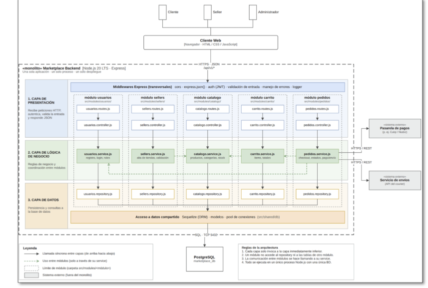

# Estilo Arquitectónico

**Proyecto:** Marketplace Backend
**Estilo seleccionado:** Monolito modular con arquitectura en capas (Layered Architecture)

---

## 1. Descripción general

El sistema se construye como un **monolito**: una sola aplicación, un solo proceso y un solo despliegue (Node.js 20 LTS + Express), conectada a una única base de datos PostgreSQL (`marketplace_db`).

Internamente, el código se organiza en dos ejes combinados:

- **Eje horizontal (módulos de dominio):** `usuarios`, `sellers`, `catalogo`, `carrito` y `pedidos`. Cada módulo vive en su propia carpeta `src/modules/<modulo>/`.
- **Eje vertical (capas):** dentro de cada módulo se separan las responsabilidades en tres capas: presentación, lógica de negocio y datos.

El resultado es un **monolito modular en capas**: simple de desarrollar, probar y desplegar, pero con límites claros que facilitan su mantenimiento y una eventual evolución hacia servicios independientes.

## 2. Diagrama de arquitectura

## 3. Componentes principales

### 3.1 Actores y cliente

| Componente | Descripción |
|---|---|
| Actores | Cliente, Seller y Administrador interactúan con el sistema a través del cliente web. |
| Cliente Web | Aplicación en el navegador (HTML / CSS / JavaScript) que consume la API. |

### 3.2 Backend (monolito)

| Elemento | Descripción |
|---|---|
| Runtime / framework | Node.js 20 LTS + Express. |
| Interfaz | API REST sobre HTTPS con intercambio en JSON (`/api/v1/*`). |
| Middlewares transversales | CORS, `express.json()`, autenticación (JWT), validación de entrada, manejo de errores y logger. Aplican a todos los módulos. |

### 3.3 Capas

| Capa | Responsabilidad | Artefactos por módulo |
|---|---|---|
| **1. Presentación** | Recibe las peticiones HTTP, autentica, valida la entrada y responde en JSON. | `*.routes.js`, `*.controller.js` |
| **2. Lógica de negocio** | Contiene las reglas de negocio y coordina la interacción entre módulos. | `*.service.js` |
| **3. Datos** | Persistencia y consultas a la base de datos. | `*.repository.js` + acceso compartido (Sequelize, modelos, pool de conexiones en `src/shared/db`) |

### 3.4 Módulos de dominio

| Módulo | Ruta | Responsabilidad |
|---|---|---|
| Usuarios | `src/modules/usuarios/` | Registro, login y roles. |
| Sellers | `src/modules/sellers/` | Alta de tiendas y validación. |
| Catálogo | `src/modules/catalogo/` | Productos, categorías y stock. |
| Carrito | `src/modules/carrito/` | Ítems y totales. |
| Pedidos | `src/modules/pedidos/` | Checkout, estados y pasarela de pago. |

### 3.5 Sistemas externos

| Sistema | Protocolo | Uso |
|---|---|---|
| Pasarela de pagos (p. ej. Culqi / Niubiz) | HTTPS / REST | Procesamiento de pagos desde el módulo de pedidos. |
| Servicio de envíos (API de courier) | HTTPS / REST | Gestión de envíos desde el módulo de pedidos. |

### 3.6 Base de datos

PostgreSQL (`marketplace_db`), accedida por TCP en el puerto 5432 mediante Sequelize.

## 4. Reglas de la arquitectura

1. **Dependencia entre capas:** cada capa solo invoca a la capa inmediatamente inferior (presentación → negocio → datos).
2. **Acceso a datos:** un módulo solo accede a su propio repository y a las tablas de su módulo.
3. **Comunicación entre módulos:** se realiza únicamente llamando al **service** del otro módulo, nunca a su repository ni a sus tablas.
4. **Despliegue único:** todo se ejecuta en un solo proceso Node.js con una sola base de datos.

### Leyenda del diagrama

| Símbolo | Significado |
|---|---|
| Flecha continua | Llamada síncrona entre capas (de arriba hacia abajo). |
| Flecha punteada | Uso entre módulos (solo a través del service). |
| Recuadro de módulo | Límite de módulo (carpeta `src/modules/<módulo>/`). |
| Recuadro gris | Sistema externo (fuera del monolito). |

## 5. Justificación de la elección

- **Simplicidad operativa:** un solo artefacto, un solo despliegue y una sola base de datos reducen la complejidad de infraestructura, adecuada para el alcance y el tamaño del equipo.
- **Separación de responsabilidades:** las capas aíslan HTTP, reglas de negocio y persistencia, lo que facilita las pruebas y los cambios localizados.
- **Modificabilidad y mantenibilidad:** los módulos con límites claros y comunicación solo vía services evitan el acoplamiento por base de datos.
- **Consistencia transaccional:** al compartir una única base de datos, operaciones como el checkout (carrito → pedido → stock) pueden ejecutarse en una sola transacción.
- **Evolución futura:** si un módulo (por ejemplo, `pedidos` o `catalogo`) requiere escalar de forma independiente, su aislamiento permite extraerlo como servicio con bajo costo.

## 6. Compromisos y riesgos

| Aspecto | Consecuencia | Mitigación |
|---|---|---|
| Escalado | Se escala la aplicación completa, no por módulo. | Escalado horizontal con balanceador; extracción futura de módulos críticos. |
| Disponibilidad | Un fallo en el proceso afecta a todo el sistema. | Monitoreo, reinicio automático y manejo de errores centralizado. |
| Acoplamiento | Riesgo de que los módulos se acoplen con el tiempo. | Respetar las reglas de la sección 4 y revisarlas en code review. |
| Base de datos única | Punto único de contención y de falla. | Índices, pool de conexiones, respaldos y réplicas de lectura si fuera necesario. |
| Dependencias externas | Pagos y envíos dependen de terceros. | Timeouts, reintentos y manejo de errores en los services de `pedidos`. |
